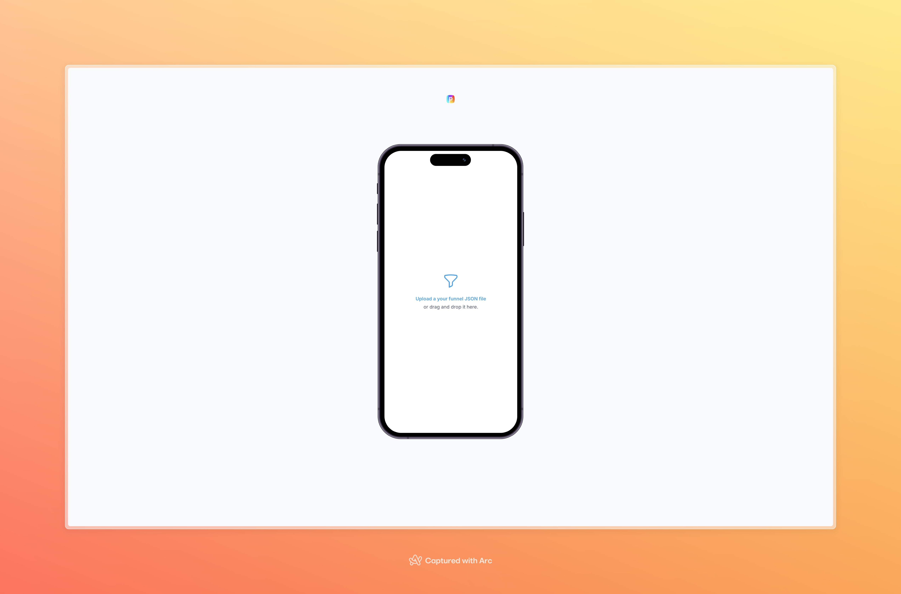
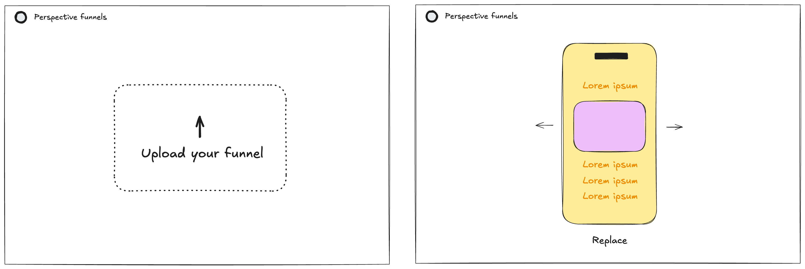
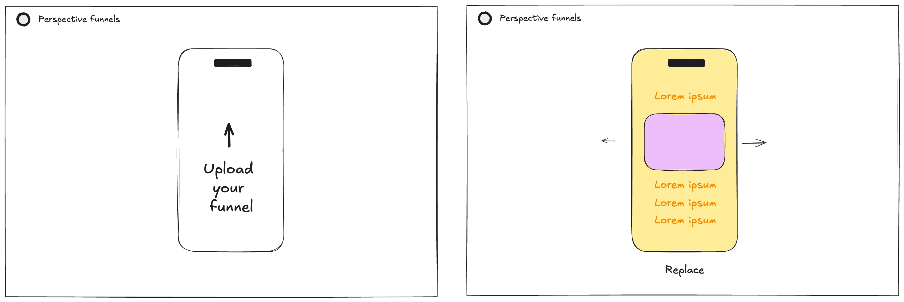
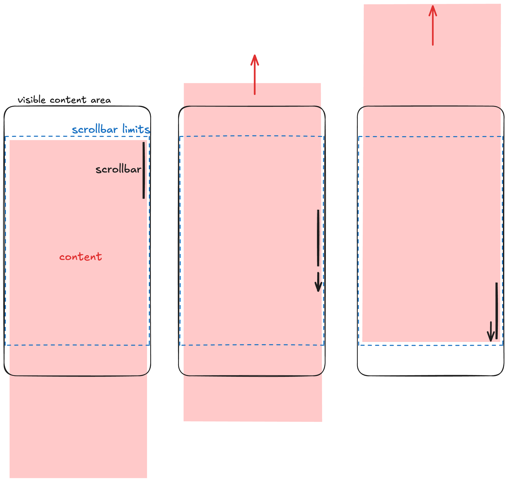

# Perspective Funnel Viewer



This app was created in response to [this test-case brief](https://www.notion.so/perspectiveco/Work-Sample-Senior-Frontend-Engineer-Daniel-da-Rocha-142f87b6a8448091847ee8eb3b9c68f9).

**[Try it out!](https://perspective-funnels-1337.vercel.app/)**

## Implementation

The app is designed with a straightforward two-screen approach. Initially, I planned to create one screen for uploading files and another for previewing the funnels. Users would alternate between these two screens as they tested different funnel configurations.



To improve the user experience, I embedded the file uploader directly inside the phone frame interface, rather than having it as a separate screen. This creates the visual impression of loading the funnel directly into the device, resulting in a more intuitive and seamless interaction flow:



To implement this flow, I used the following libraries and tools:

- A simple Next.js app, boostrapped with `create-next-app` and in TypeScript
- TailwindCSS for styling plus a few additional classes (mostly for animations and scroolbar styling)
- `react-dropzone` to implement the drag and drop of the JSON files
- `tailwind-merge` and `clsx` for class manipulations in the components
- `@formkit/auto-animate` for the page transitions within the funnel preview
- [devices.css](https://devicescss.xyz/) for the phone frame

## Areas I'd like to improve on

Due to time-constraints, I took some shortcuts and made some decisions that could be reconsidered in future iterations:

**Testing**

This version has no tests. It is a very simple application, and the implemented error checks and reporting should prevent it from breaking on most cases. Naturally, tests would help ensuring that "most cases" and edge cases would make the application fail correctly. This would be particularly important as the application evolves with new features and user flows, to help ensure it remains stable.

Using modern testing tools such as `vitest` and `@testing-library/react`, I would start by implementing tests on the core areas of the application. The initial focus would be on unit and integration tests for file uploading (`FileUploader.tsx`) and funnel previewing components (`FunnelPreview.tsx`, `FunnelPage.tsx` and `FunnelBlocks.tsx`). We would also need further unit tests to ensure our utils or custom hooks would not break. These tests would form the foundation of our testing strategy.

Later on, if the application grows in complexity, E2E tests could come in handy. Tools like Playwright or Cypress would be excellent choices for implementing these end-to-end tests.

**Library Usage**

Several of the third-party libraries we're using, like `react-dropzone` for file handling and `@formkit/auto-animate` for animations, provide relatively straightforward functionality that could be implemented directly using standard Web APIs. Creating our own custom implementations would reduce dependencies while maintaining the same core features.

**Responsiveness**

Currently, the app lacks mobile responsiveness and doesn't function well on mobile devices. A future enhancement could remove the phone frame below a certain screen size, allowing users to view the funnel directly on their mobile device. However, this would make more sense as part of version 2.0, when we transition from manual JSON file uploads (which are cumbersome on mobile) to fetching funnel data via an API. This API-driven approach would enable a fully functional mobile experience where users could interact directly with funnel contents.

**Phone frame**

The current phone frame serves its purpose as a proof-of-concept, but future iterations could offer more device options with various sizes and styles (according to user needs/requests, of course). Users should also have the ability to disable the frame display entirely for a more flexible viewing experience.

The browser's default scrollbar, while styled to match the design, remains visually inconsistent with the mobile experience. An ideal implementation would replicate the temporary scrollbar behavior seen on mobile devices - where the scrollbar appears briefly during scrolling and then fades away. This would require custom JavaScript implementation for scrollbar and scroll area controls. I began exploring this approach but had to defer it due to time limitations.



**Pagination**

Adding pagination controls would improve usability when users are simultaneously editing and previewing funnels, allowing them to quickly jump to specific pages rather than scrolling through sequentially.

**Dark mode**

Dark mode could be implemented in two ways:

1. For the main application interface ("lights off" mode)
2. Within the preview frame itself, to demonstrate how funnels would appear for users with dark mode enabled on their devices

Adding dark mode support for the preview frame would require extending the funnel configuration format to include dark mode-specific color definitions for each block.

**Icon usage**

Currently, icons are directly embedded within component files for simplicity since we only use a few icons. As the application scales, we should implement a more maintainable icon management system, such as storing icons in separate SVG files and importing them as needed.

## Technical details

This is a [Next.js](https://nextjs.org) project bootstrapped with [`create-next-app`](https://nextjs.org/docs/app/api-reference/cli/create-next-app).

To run it locally, first install all dependencies and then run the dev server:

```bash
npm install
npm run dev
# or
yarn install
yarn dev
# or
pnpm install
pnpm dev
# or
bun install
bun dev
```

Open [http://localhost:4000](http://localhost:4000) with your browser to see the result.
